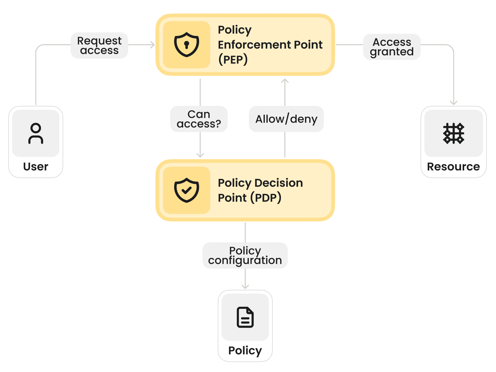

#  Secure MCP Server Infrastructure: Zero Trust for AI Agents

---

## 1. Overview

This repository documents the reference architecture for building a secure **Model Context Protocol (MCP)** infrastructure.

As **AI agents** become capable of executing code and accessing proprietary data, they introduce a new perimeter that traditional API gateways cannot easily protect. The primary goal of this architecture is to solve the **"Confused Deputy"** problem and the **"Broken Chain of Identity"** in AI systems.

By implementing **Externalized Authorization**, we decouple the decision-making (PDP) from the execution (PEP), ensuring that AI agents—regardless of their intelligence, prompts, or "jailbreaks"—can only access tools and resources they are explicitly authorized to use.

---

## 2. The Core Security Challenge

### 2.1. The "Confused Deputy" Problem

In a standard deployment, an MCP server often runs with a high-privilege **Service Account** (e.g., SuperAdmin) to access various backend tools. An AI Agent, acting on behalf of a standard user, connects to this server. If the Agent is tricked (via **prompt injection**) into requesting sensitive data, the MCP server—using its super-user credentials—will obligingly fetch it. The server is the **"Confused Deputy"**: it has the authority to access the data, but it has been misused by a lower-privilege entity.

### 2.2. Broken Chain of Identity

When an Agent calls a tool, the original **User's identity is often lost**, replaced by the Agent's identity or the MCP Server's identity. This prevents downstream microservices from enforcing user-level permissions.

> **The Solution:** This architecture enforces **Identity Propagation** and **Continuous Verification** at every step.

---

## 3. Architecture: The PDP/PEP Pattern

We implement a rigorous **Attribute-Based Access Control (ABAC)** model. No AI agent interacts directly with backend tools without passing through a security gate.


### High-Level Data Flow

1.  **Request:** The **AI Agent (Client)** sends a JSON-RPC request (e.g., `call_tool("database_query", { "table": "salaries" })`).
2.  **Interception (PEP):** The **MCP Server** intercepts the request at the middleware layer before any tool logic is executed.
3.  **Auth Query:** The **PEP** suspends the request and sends a query to the **Policy Decision Point (PDP)**. It passes:
    * **Principal:** The **Compound Identity** (e.g., User:Alice via Agent:CodingBot).
    * **Action:** The specific tool (`database_query`).
    * **Resource:** The target (`table:salaries`).
    * **Context:** Time of day, IP address, previous session risk score.
4.  **Evaluation (PDP):** The **Cedar Engine** evaluates the request against formally verified security policies. It returns a definitive **PERMIT** or **DENY**.
5.  **Enforcement:**
    * **PERMIT:** The PEP allows the tool to execute.
    * **DENY:** The PEP blocks the request immediately, logging the violation for audit.
  


---

## 4. Core Components & Technology Stack

This infrastructure utilizes a polyglot microservices approach, selecting the language that offers the best performance and safety for each specific layer.

### 4.1. Policy Decision Point (PDP) - The "Brain"

* **Technology:** **Cedar** (by AWS) running on **Rust**.

| Why Cedar? | Why Rust? |
| :--- | :--- |
| **Formal Verification:** Policies can be mathematically proven. | **Safety:** Memory safety and lack of garbage collection pauses. |
| **Safety:** Secure-by-design, preventing common logic bugs. | **Performance:** Ensures **sub-millisecond latency** for authorization checks. |

**Example Cedar Policy (`policies/agent_access.cedar`):**
```
// Attribute-Based Access Control (ABAC) Example // Allow an agent to read data only if the user owns it // AND the agent is in a 'trusted' session.

permit ( principal, action == Action::"read_file", resource ) when { // The user driving the agent must own the resource resource.owner == principal.user_id &&

// The agent must be marked as verified/trusted
principal.agent_trust_level >= 5
};
```

### 4.2. Policy Enforcement Point (PEP) / MCP Server - The "Gatekeeper"

* **Technology:** Python (**FastAPI**) or Go (**Golang**).
* **Role:** This service hosts the MCP protocol and defines the tools. It contains **zero business authorization logic** (no `if user == admin` statements).

| Language Choice | Best Use Case |
| :--- | :--- |
| **Python** | If the MCP Server needs to use **Data Science libraries** (Pandas, NumPy) or interact directly with LLM logic / LangChain. |
| **Go (Golang)** | Best choice for **high-concurrency Gateway** servers or simply routing requests to other internal microservices. |

**PEP Middleware Implementation (Pseudo-code):**

```python
# Middleware intercepting every JSON-RPC call
async def intercept_tool_call(request, tool_name, params):
    # 1. Reconstruct Identity
    user_id = request.headers.get("X-User-ID")
    agent_id = request.headers.get("X-Agent-ID")
    
    # 2. Build Auth Context
    auth_context = {
        "principal": { "type": "Compound", "user": user_id, "agent": agent_id },
        "action": tool_name,
        "resource": detect_resource(params)
    }
    
    # 3. Query PDP (Cedar Sidecar)
    decision = await cedar_client.check_permission(auth_context)
    
    # 4. Strict Enforcement
    if decision == "DENY":
        security_logger.warn(f"Unauthorized access attempt by {agent_id}")
        raise PermissionDeniedError("Access Denied by Policy Engine")
        
    # 5. Proceed
    return await execute_tool(tool_name, params)
```

## 5. Infrastructure & Deployment 

To ensure security and scalability, the infrastructure is **containerized and orchestrated**.

### 5.1. Container Strategy (Sidecar Pattern)

We utilize the **Sidecar Pattern** for the **Policy Decision Point (PDP)** to minimize network latency and improve reliability. 

* **Main Container (PEP):** Runs the MCP Server (Python/Go).
* **Sidecar Container (PDP):** Runs the Cedar Engine (Rust).
* **Benefit:** The MCP Server talks to the PDP via **localhost**, ensuring authorization checks are instantaneous and don't fail due to network issues.

### 5.2. Network Isolation (Kubernetes)

We use **Kubernetes Network Policies** to enforce a **"Default Deny"** stance.

* **Ingress:** The MCP Server accepts traffic only from the authorized LLM Orchestrator (via **mTLS**).
* **Egress:** The MCP Server can only connect to:
    * The specific internal APIs it tools for (e.g., `postgres-db`, `crm-api`).
    * The Logging/Audit service.
* **It cannot access the public internet.**

---

## 6. Building a Secure MCP Infrastructure (Step-by-Step) 

### Step 1: Define Your Identity Model

Define **"Who"** your agents are. We recommend a **Compound Identity** model:

> **Principal:** Not just "ChatBot", but **"ChatBot acting on behalf of User Alice"**.
This ensures the PDP can check permissions against Alice's entitlements, not just the Bot's.

### Step 2: Write & Test Policies

* **Unit Test Policies:** Use Cedar's testing framework to verify your policies.
* **Allow-List Approach:** Start with an implicit deny. **Explicitly permit only necessary tools.**

### Step 3: Implement PEP Middleware

Write a **Global Interceptor** in your MCP Server that wraps every JSON-RPC request. This ensures that developers adding new tools cannot **"forget"** to add security checks. **Do not hardcode checks inside every tool function.**

### Step 4: Centralized Audit Logging

The PEP must log every decision to a **tamper-proof logging service**.

> **Log Format:** `[Timestamp] [CompoundID] [ToolName] [Resource] [PDP_Decision]`
This provides the **"black box" recorder** needed to debug or detect an active attack.

---

## 7. Security Checklist 

* [**X**] **Externalize Auth:** Remove all `if/else` permission logic from the MCP Server code.
* [**X**] **Fail Closed:** If the PDP is unreachable, the MCP Server **must deny all requests**.
* [**X**] **Input Validation:** The PEP must validate that `tool_arguments` match expected schemas before sending them to the PDP.
* [**X**] **Least Privilege:** The MCP Service Account in Kubernetes should have **read-only access** to most resources.
* [**X**] **Identity Propagation:** Ensure the original User ID is passed through the chain, not just the Agent ID.

---

## 8. Future Improvements 

* **Just-in-Time (JIT) Access:** The Agent requests permission for a high-stakes tool, triggering a **human-in-the-loop approval** (e.g., via Slack/Teams). The PDP then updates the policy to PERMIT for a short window.
* **Risk-Based Auth:** Feeding **"Prompt Risk Score"** (from a separate guardrail model) into the PDP context, so risky prompts are automatically denied sensitive tools.
